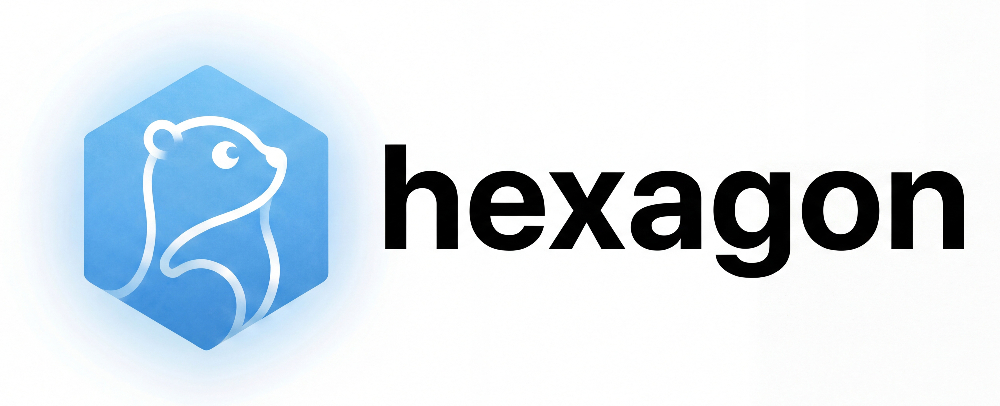

<div align="right">语言: 中文 | <a href="README.en.md">English</a></div>

<div align="center">



**Go 生态全能型 AI Agent 框架**

[](https://pkg.go.dev/github.com/hexagon-codes/hexagon)
[](LICENSE)
[](https://github.com/hexagon-codes/hexagon/actions)

</div>

---

### 📖 项目简介

**Hexagon** 取名自网络热词「**六边形战士**」，寓意均衡强大、无懈可击。

我们聚焦 **易用性、性能、扩展性、任务编排、可观测性、安全性** 六大核心维度，深耕技术打磨，致力于实现各能力模块的均衡卓越，为 Go 开发者打造企业级落地首选的 AI Agent 开发基座。

</p>

### 🚀 核心特性

* ⚡ **高性能** │ 原生 Go 驱动，极致并发，支持 100k+ 活跃 Agent
* 🧩 **易用性** │ 声明式 API 设计，3 行代码极速构建基础原型
* 🛡️ **安全性** │ 企业级沙箱隔离，内置完备的权限管控与防护
* 🔧 **扩展性** │ 插件化架构，支持高度自定义的组件无缝集成
* 🛠️ **编排力** │ 强大的图编排引擎，轻松驾驭复杂的多级任务链路
* 🔍 **可观测** │ 深度集成 OpenTelemetry，实现全链路透明追踪

---

## 🌐 生态系统

Hexagon 是一个完整的 AI Agent 开发生态，由多个仓库组成：

| 仓库 | 说明 | 链接 |
|-----|------|------|
| **hexagon** | AI Agent 框架核心 (编排、RAG、Graph、Hooks) | [github.com/hexagon-codes/hexagon](https://github.com/hexagon-codes/hexagon) |
| **ai-core** | AI 基础能力库 (LLM/Tool/Memory/Schema) | [github.com/hexagon-codes/ai-core](https://github.com/hexagon-codes/ai-core) |
| **toolkit** | Go 通用工具库 (lang/crypto/net/cache/util) | [github.com/hexagon-codes/toolkit](https://github.com/hexagon-codes/toolkit) |
| **hexagon-ui** | Dev UI 前端 (Vue 3 + TypeScript) | [github.com/hexagon-codes/hexagon-ui](https://github.com/hexagon-codes/hexagon-ui) |

### 🧠 ai-core — AI 基础能力库

提供 LLM、Tool、Memory、Schema 等核心抽象，支持多种 LLM Provider：

```go
import "github.com/hexagon-codes/ai-core/llm"
import "github.com/hexagon-codes/ai-core/llm/openai"
import "github.com/hexagon-codes/ai-core/tool"
import "github.com/hexagon-codes/ai-core/memory"
```

**主要模块：**
- `llm/` - LLM Provider 接口 + 实现 (OpenAI, DeepSeek, Anthropic, Gemini, 通义, 豆包, Ollama)
- `llm/router/` - 智能模型路由 (任务感知 + 模型能力档案)
- `tool/` - 工具系统，支持函数式定义
- `memory/` - 记忆系统，支持向量存储
- `schema/` - JSON Schema 自动生成
- `streamx/` - 流式响应处理
- `template/` - Prompt 模板引擎

### 🛠️ toolkit — Go 通用工具库

生产级 Go 通用工具包，提供语言增强、加密、网络、缓存、协程池等基础能力：

```go
import "github.com/hexagon-codes/toolkit/lang/conv"      // 类型转换
import "github.com/hexagon-codes/toolkit/lang/stringx"   // 字符串工具
import "github.com/hexagon-codes/toolkit/lang/syncx"     // 并发工具
import "github.com/hexagon-codes/toolkit/net/httpx"      // HTTP 客户端
import "github.com/hexagon-codes/toolkit/net/sse"        // SSE 客户端
import "github.com/hexagon-codes/toolkit/util/retry"     // 重试机制
import "github.com/hexagon-codes/toolkit/util/idgen"     // ID 生成
import "github.com/hexagon-codes/toolkit/util/poolx"     // 协程池
import "github.com/hexagon-codes/toolkit/cache/local"    // 本地缓存
```

**主要模块：**
- `lang/` - 语言增强 (conv, stringx, slicex, mapx, timex, contextx, errorx, syncx)
- `crypto/` - 加密 (aes, rsa, sign)
- `net/` - 网络 (httpx, sse, ip)
- `cache/` - 缓存 (local, redis, multi)
- `util/` - 工具 (retry, rate, idgen, logger, validator, poolx 协程池)
- `collection/` - 数据结构 (set, list, queue, stack)

### 🎨 hexagon-ui — Dev UI 前端

基于 Vue 3 + TypeScript 的开发调试界面：

```bash
cd hexagon-ui
npm install
npm run dev
# 访问 http://localhost:5173
```

**功能特性：**
- 实时事件流 (SSE 推送)
- 指标仪表板
- 事件详情查看
- LLM 流式输出展示

## ⚡ 快速开始

### 📦 安装

```bash
go get github.com/hexagon-codes/hexagon
```

### ⚙️ 环境配置

```bash
# OpenAI
export OPENAI_API_KEY=your-api-key

# 或 DeepSeek
export DEEPSEEK_API_KEY=your-api-key
```

### 🎯 3 行代码入门

```go
package main

import (
    "context"
    "fmt"
    "github.com/hexagon-codes/hexagon"
)

func main() {
    response, _ := hexagon.Chat(context.Background(), "What is Go?")
    fmt.Println(response)
}
```

### 🔧 带工具的 Agent

```go
package main

import (
    "context"
    "fmt"
    "github.com/hexagon-codes/hexagon"
)

func main() {
    // 定义计算器工具
    type CalcInput struct {
        A  float64 `json:"a" desc:"第一个数字" required:"true"`
        B  float64 `json:"b" desc:"第二个数字" required:"true"`
        Op string  `json:"op" desc:"运算符" required:"true" enum:"add,sub,mul,div"`
    }

    calculator := hexagon.NewTool("calculator", "执行数学计算",
        func(ctx context.Context, input CalcInput) (float64, error) {
            switch input.Op {
            case "add": return input.A + input.B, nil
            case "sub": return input.A - input.B, nil
            case "mul": return input.A * input.B, nil
            case "div": return input.A / input.B, nil
            }
            return 0, fmt.Errorf("unknown operator")
        },
    )

    // 创建带工具的 Agent
    agent := hexagon.QuickStart(
        hexagon.WithTools(calculator),
        hexagon.WithSystemPrompt("你是一个数学助手"),
    )

    output, _ := agent.Run(context.Background(), hexagon.Input{
        Query: "计算 123 * 456",
    })
    fmt.Println(output.Content)
}
```

### 🔍 RAG 检索增强

```go
// 创建 RAG 引擎
engine := hexagon.NewRAGEngine(
    hexagon.WithRAGStore(hexagon.NewMemoryVectorStore()),
    hexagon.WithRAGEmbedder(hexagon.NewOpenAIEmbedder()),
)

// 索引文档
engine.Index(ctx, []hexagon.Document{
    {ID: "1", Content: "Go 支持并发编程"},
    {ID: "2", Content: "Go 有丰富的标准库"},
})

// 检索
docs, _ := engine.Retrieve(ctx, "Go 的特性", hexagon.WithTopK(2))
```

### 📊 图编排

```go
import "github.com/hexagon-codes/hexagon/orchestration/graph"

// 构建工作流图
g, _ := graph.NewGraph[MyState]("workflow").
    AddNode("analyze", analyzeHandler).
    AddNode("process", processHandler).
    AddEdge(graph.START, "analyze").
    AddEdge("analyze", "process").
    AddEdge("process", graph.END).
    Build()

// 执行
result, _ := g.Run(ctx, initialState)
```

### 👥 多 Agent 团队

```go
// 创建团队
team := hexagon.NewTeam("research-team",
    hexagon.WithAgents(researcher, writer, reviewer),
    hexagon.WithMode(hexagon.TeamModeSequential),
)

// 执行
output, _ := team.Run(ctx, hexagon.Input{Query: "写一篇技术文章"})
```

## 🚀 高级能力

### 🔀 智能模型路由 (Smart Router)

根据任务类型、复杂度自动选择最优模型：

```go
import "github.com/hexagon-codes/ai-core/llm/router"

// 创建智能路由器
smartRouter := router.NewSmartRouter(baseRouter,
    router.WithAutoClassify(true),
)

// 带路由上下文的请求
routingCtx := router.NewRoutingContext(router.TaskTypeCoding, router.ComplexityMedium).
    WithPriority(router.PriorityQuality).
    RequireFunctions()

resp, decision, _ := smartRouter.CompleteWithRouting(ctx, req, routingCtx)
// decision 包含: 选择的模型、得分、原因、备选方案
```

**特性：**
- 任务感知路由 (coding/reasoning/creative/analysis 等)
- 质量/成本/延迟优先级策略
- 20+ 预定义模型能力档案
- 路由历史和统计分析

### ⚙️ 确定性业务流程 (Process Framework)

状态机驱动的业务流程框架：

```go
import "github.com/hexagon-codes/hexagon/process"

// 定义订单处理流程
p, _ := process.NewProcess("order-processing").
    AddState("pending", process.AsInitial()).
    AddState("validated").
    AddState("processing").
    AddState("completed", process.AsFinal()).
    AddState("failed", process.AsFinal()).

    // 状态转换
    AddTransition("pending", "validate", "validated",
        process.WithGuard(func(ctx context.Context, data *process.ProcessData) bool {
            return data.Get("amount") != nil
        })).
    AddTransition("validated", "process", "processing").
    AddTransition("processing", "complete", "completed").
    AddTransition("processing", "fail", "failed").

    // 绑定 Agent 到状态
    OnStateEnter("validated", step.NewAgentStep("validator", validatorAgent)).
    Build()

// 执行流程
output, _ := p.Invoke(ctx, process.ProcessInput{
    Data: map[string]any{"order_id": "123", "amount": 100},
})
```

**特性：**
- 状态机驱动，确定性执行
- 支持守卫条件和转换动作
- 步骤类型：Action/Agent/Condition/Parallel/Sequence/Retry/Timeout
- 流程生命周期：Start/Pause/Resume/Cancel
- 完整实现 Runnable 六范式接口

### 📄 智能文档工作流 (ADW)

超越传统 RAG 的端到端文档自动化：

```go
import "github.com/hexagon-codes/hexagon/adw"
import "github.com/hexagon-codes/hexagon/adw/extractor"
import "github.com/hexagon-codes/hexagon/adw/validator"

// 定义提取 Schema
schema := adw.NewExtractionSchema("invoice").
    AddStringField("invoice_number", "发票号码", true).
    AddDateField("date", "日期", "YYYY-MM-DD", true).
    AddMoneyField("amount", "金额", true).
    AddStringField("vendor", "供应商", false)

// 创建处理管道
pipeline := adw.NewPipeline("invoice-processing").
    AddStep(adw.NewDocumentTypeDetectorStep()).
    AddStep(extractor.NewLLMExtractionStep(llmProvider, schema)).
    AddStep(extractor.NewEntityExtractionStep(llmProvider)).
    AddStep(validator.NewSchemaValidationStep(schema)).
    AddStep(adw.NewConfidenceCalculatorStep()).
    Build()

// 处理文档
output, _ := pipeline.Process(ctx, adw.PipelineInput{
    Documents: documents,
    Schema:    schema,
})

// 访问结果
for _, doc := range output.Documents {
    fmt.Println("发票号:", doc.StructuredData["invoice_number"])
    fmt.Println("实体:", doc.Entities)
    fmt.Println("验证:", doc.IsValid())
}
```

**特性：**
- Document 扩展：结构化数据/表格/实体/关系/验证错误
- Schema 驱动的结构化提取
- LLM 提取器：实体/关系提取
- 完整验证：类型/格式/范围/枚举/正则
- 并发处理 + 钩子系统

### 🌐 A2A 协议 (Agent-to-Agent)

实现 Google A2A 协议，支持标准化的 Agent 间通信：

```go
import "github.com/hexagon-codes/hexagon/a2a"

// 将 Hexagon Agent 暴露为 A2A 服务
server := a2a.ExposeAgent(myAgent, "http://localhost:8080")
server.Start(":8080")

// 连接远程 A2A Agent
client := a2a.NewClient("http://remote-agent.example.com")
card, _ := client.GetAgentCard(ctx)

// 发送消息
task, _ := client.SendMessage(ctx, &a2a.SendMessageRequest{
    Message: a2a.NewUserMessage("你好"),
})

// 流式交互
events, _ := client.SendMessageStream(ctx, req)
for event := range events {
    switch e := event.(type) {
    case *a2a.ArtifactEvent:
        fmt.Print(e.Artifact.GetTextContent())
    }
}
```

**特性：**
- 完整 A2A 协议实现 (AgentCard/Task/Message/Artifact)
- JSON-RPC 2.0 + SSE 流式响应
- 多种认证方式 (Bearer Token/API Key/Basic Auth/RBAC)
- Agent 发现服务 (Registry/Static/Remote)
- 推送通知支持
- 与 Hexagon Agent 无缝桥接

## 💡 设计理念

1. **渐进式复杂度** - 入门 3 行代码，进阶声明式配置，专家图编排
2. **约定优于配置** - 合理默认值，零配置可运行
3. **组合优于继承** - 小而专注的组件，灵活组合
4. **显式优于隐式** - 类型安全，编译时检查
5. **生产优先** - 内置可观测性，优雅降级

## 🏗️ 架构

### 📐 整体架构


### 🔗 生态系统依赖


### 📈 数据流


## 🤖 LLM 支持

| Provider | 状态 |
|----------|------|
| OpenAI (GPT-4, GPT-4o, o1, o3) | ✅ 已支持 |
| DeepSeek | ✅ 已支持 |
| Anthropic (Claude) | ✅ 已支持 |
| Google Gemini | ✅ 已支持 |
| 通义千问 (Qwen) | ✅ 已支持 |
| 豆包 (Ark) | ✅ 已支持 |
| Ollama (本地模型) | ✅ 已支持 |

## 📁 项目结构

```
hexagon/
├── agent/              # Agent 核心 (ReAct/Role/Team/Handoff/State/Primitives)
├── a2a/                # A2A 协议 (Client/Server/Handler/Discovery)
├── core/               # 统一接口 (Component[I,O], Stream[T])
├── orchestration/      # 编排引擎
│   ├── graph/          # 图编排 (状态图/检查点/Barrier/分布式/可视化)
│   ├── flow/           # Flow 流程编排 (可配置超时)
│   ├── chain/          # 链式编排
│   ├── workflow/       # 工作流引擎
│   └── planner/        # 规划器
├── process/            # 确定性业务流程框架 (状态机驱动)
│   └── step/           # 步骤类型 (Action/Agent/Condition/Parallel)
├── adw/                # 智能文档工作流 (Agentic Document Workflows)
│   ├── extractor/      # 结构化提取器
│   └── validator/      # Schema 验证器
├── rag/                # RAG 系统
│   ├── loader/         # 文档加载 (Text/Markdown/CSV/XLSX/PPTX/DOCX/PDF/OCR)
│   ├── splitter/       # 文档分割 (Character/Recursive/Markdown/Sentence/Token/Code)
│   ├── retriever/      # 检索器 (Vector/Keyword/Hybrid/HyDE/Adaptive/ParentDoc)
│   ├── reranker/       # 重排序
│   └── synthesizer/    # 响应合成
├── memory/             # 多 Agent 记忆共享
├── artifact/           # 工件系统
├── mcp/                # MCP 协议支持
├── hooks/              # 钩子系统 (Run/Tool/LLM/Retriever)
├── observe/            # 可观测性 (Tracer/Metrics/OTel/DevUI)
├── security/           # 安全防护 (Guard/RBAC/Cost/Audit/Filter)
├── tool/               # 工具系统 (File/Python/Shell/Sandbox)
├── store/              # 存储
│   └── vector/         # 向量存储 (Qdrant/FAISS/PgVector/Redis/Milvus/Chroma/Pinecone/Weaviate)
├── plugin/             # 插件系统
├── config/             # 配置管理
├── evaluate/           # 评估系统
├── testing/            # 测试工具 (Mock/Record)
├── deploy/             # 部署配置 (Docker Compose/Helm Chart/CI)
├── examples/           # 示例代码
├── hexagon.go          # 顶层 API（18 个核心符号）
└── deprecated.go       # 过渡性重导出（下一大版本移除）
```

## ⚠️ 近期重要变更

### 顶层 API 瘦身（v0.3.2-beta）

`hexagon.go` 的导出符号从 98 个精简至 **18 个核心符号**，仅保留最常用的入口：

- `Chat()`, `ChatWithTools()`, `Run()` — 便捷函数
- `QuickStart()` 及选项函数 (`WithProvider`, `WithTools`, `WithSystemPrompt`, `WithMemory`)
- `NewTool()` — 工具创建
- `SetDefaultProvider()` — 设置默认 LLM Provider
- 核心类型重导出 (`Input`, `Output`, `Tool`, `Memory`, `Message`, `Agent`, `Provider`)
- `Version` 常量

其余所有导出均已移至 `deprecated.go`，附带弃用注释，**将在下一个大版本中移除**。

**迁移方式：** 直接 import 对应子包，而非通过顶层包访问。例如：

```go
// 旧方式（已弃用）
team := hexagon.NewTeam("my-team", hexagon.WithAgents(a1, a2))
engine := hexagon.NewRAGEngine(hexagon.WithRAGStore(store))

// 新方式（推荐）
import "github.com/hexagon-codes/hexagon/agent"
import "github.com/hexagon-codes/hexagon/rag"

team := agent.NewTeam("my-team", agent.WithAgents(a1, a2))
engine := rag.NewEngine(rag.WithStore(store))
```

### Bug 修复与改进

- **`RunWithStats` 并发安全** — 使用本地节点副本，消除多 goroutine 间的数据竞争
- **`ParallelForEachLoopNode` 不再死锁** — 修复 context 取消时的死锁问题
- **`RecursiveSplitter` 防无限循环** — 当 overlap >= chunkSize 时自动保护
- **`SetDefaultProvider` 时序修复** — 即使在 `Chat()`/`QuickStart()` 之前调用也会被正确使用

## 📚 文档

### 📄 核心文档

| 文档 | 说明 |
|-----|------|
| [快速入门](docs/QUICKSTART.md) | 5 分钟上手 Hexagon |
| [架构设计](docs/DESIGN.md) | 框架设计理念和架构 |
| [API 参考](docs/API.md) | 完整 API 文档 |
| [稳定性说明](docs/STABILITY.md) | API 稳定性和版本策略 |
| [框架对比](docs/comparison.md) | 与主流框架的对比分析 |

### 📖 使用指南

| 指南 | 说明 |
|-----|------|
| [快速开始](docs/guides/getting-started.md) | 从零开始构建第一个 Agent |
| [Agent 开发](docs/guides/agent-guide.md) | Agent 开发完整指南 |
| [Agent 进阶](docs/guides/agent-development.md) | 高级 Agent 开发模式 |
| [RAG 系统](docs/guides/rag-guide.md) | 检索增强生成入门 |
| [RAG 集成](docs/guides/rag-integration.md) | RAG 系统深度集成 |
| [图编排](docs/guides/graph-orchestration.md) | 复杂工作流编排 |
| [多 Agent](docs/guides/multi-agent.md) | 多 Agent 协作系统 |
| [插件开发](docs/guides/plugin-guide.md) | 插件系统使用指南 |
| [可观测性](docs/guides/observability.md) | 追踪、指标、日志集成 |
| [安全防护](docs/guides/security.md) | 安全最佳实践 |
| [性能优化](docs/guides/performance-optimization.md) | 性能调优指南 |

### 💻 示例代码

| 示例 | 说明 |
|-----|------|
| [examples/quickstart](examples/quickstart) | 快速入门示例 |
| [examples/react](examples/react) | ReAct Agent 示例 |
| [examples/rag](examples/rag) | RAG 检索示例 |
| [examples/graph](examples/graph) | 图编排示例 |
| [examples/team](examples/team) | 多 Agent 团队示例 |
| [examples/handoff](examples/handoff) | Agent 交接示例 |
| [examples/chatbot](examples/chatbot) | 聊天机器人示例 |
| [examples/code-review](examples/code-review) | 代码审查示例 |
| [examples/data-analysis](examples/data-analysis) | 数据分析示例 |
| [examples/qdrant](examples/qdrant) | Qdrant 向量存储示例 |
| [examples/devui](examples/devui) | Dev UI 示例 |

## 🖥️ Dev UI

内置开发调试界面，实时查看 Agent 执行过程。

```go
import "github.com/hexagon-codes/hexagon/observe/devui"

// 创建 DevUI
ui := devui.New(
    devui.WithAddr(":8080"),
    devui.WithMaxEvents(1000),
)

// 启动服务
go ui.Start()

// 访问 http://localhost:8080
```

**运行示例：**

```bash
# 启动后端
go run examples/devui/main.go

# 启动前端 (hexagon-ui)
cd ../hexagon-ui
npm install
npm run dev
# 访问 http://localhost:5173
```

## 🚢 部署

Hexagon 提供三种部署方式，支持本地开发到生产环境的全场景覆盖：

| 方案 | 适用场景 | 命令 |
|------|---------|------|
| Docker Compose (完整模式) | 快速体验、演示、单机部署 | `make up` |
| Docker Compose (开发模式) | 团队开发（复用 docker-dev-env） | `make dev-up` |
| Helm Chart | K8s 集群、生产环境 | `make helm-install` |

### Docker 快速启动

```bash
cd deploy
cp .env.example .env
# 编辑 .env，填入 LLM API Key
make up

# 访问
# 主应用:  http://localhost:8000
# Dev UI:  http://localhost:8080
```

### Kubernetes / Helm

```bash
cd deploy
make helm-install

# 使用外部基础设施
helm install hexagon helm/hexagon/ \
  -n hexagon --create-namespace \
  --set qdrant.enabled=false \
  --set external.qdrant.url=http://my-qdrant:6333
```

详见 [部署指南](deploy/README.md)。

## 🔨 开发

```bash
make build   # 构建
make test    # 测试
make lint    # 代码检查
make fmt     # 格式化
```

## 🤝 贡献

欢迎贡献！请阅读 [CONTRIBUTING.md](CONTRIBUTING.md) 了解如何参与。

## 📜 许可证

[Apache License 2.0](LICENSE)

```
Copyright 2026 hexagon-codes

Licensed under the Apache License, Version 2.0 (the "License");
you may not use this file except in compliance with the License.
You may obtain a copy of the License at

    http://www.apache.org/licenses/LICENSE-2.0

Unless required by applicable law or agreed to in writing, software
distributed under the License is distributed on an "AS IS" BASIS,
WITHOUT WARRANTIES OR CONDITIONS OF ANY KIND, either express or implied.
See the License for the specific language governing permissions and
limitations under the License.
```
